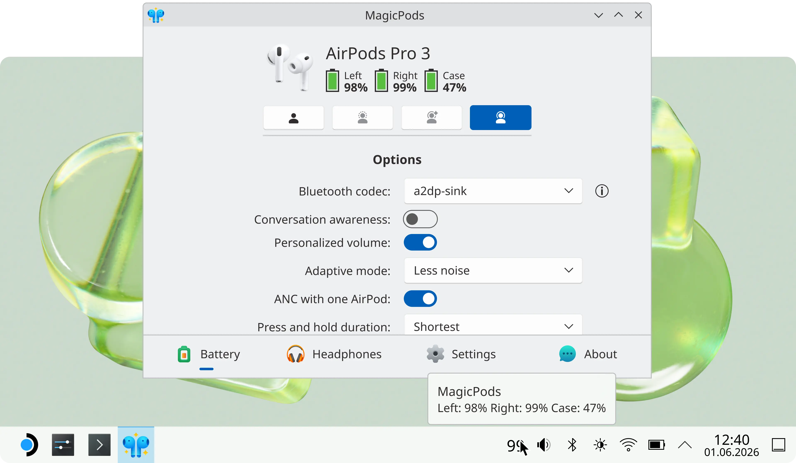

# MagicPods✨ for Linux

Use AirPods, Beats, and compatible Galaxy Buds on SteamOS or Linux with full control and battery monitoring. MagicPods seamlessly integrates your headphones with Steam Deck and Steam Machine, bringing iOS-style functionality to your gaming setup.

Tested on Kubuntu 26.04, Ubuntu 26.04, and SteamOS 3.7.24.

### 🎨 Features

#### Battery Monitoring

View battery levels inside the app, in the tray widget, or through the [MagicPodsDecky](https://github.com/steam3d/MagicPodsDecky) plugin for Decky Loader. Works with all AirPods, most Beats, and many other Bluetooth headphones.

#### Noise Control

Switch between available noise control modes directly from the app. Noise cancellation, transparency, adaptive, and off modes are supported on AirPods, Beats, and Galaxy Buds (model dependent).

#### Pop-Up Animation

An iPhone-style pop-up window appears when you open the charging case of your AirPods or Beats, showing battery information.

### Advanced Controls

Customize how your AirPods or Beats behave with support for Conversation Awareness, Personalized Volume, Adaptive Audio tuning, and configurable touch controls.

## 🎧 Headphones supported

| Apple            | Beats                  | Samsung           |
| ---------------- | ---------------------- | ----------------- |
| AirPods 1        | PowerBeats Pro         | Galaxy Buds       |
| AirPods 2        | PowerBeats Pro 2       | Galaxy Buds Plus  |
| AirPods 3        | PowerBeats 3           | Galaxy Buds Live  |
| AirPods 4        | PowerBeats 4           | Galaxy Buds Pro   |
| AirPods 4 (ANC)  | Beats Fit Pro          | Galaxy Buds 2     |
| AirPods Pro      | Beats Studio Buds      | Galaxy Buds 2 Pro |
| AirPods Pro 2    | Beats Studio Buds Plus | Galaxy Buds FE    |
| AirPods Pro 3    | Beats Studio Pro       | Galaxy Buds 3     |
| AirPods Max      | Beats Solo 3           | Galaxy Buds 3 Pro |
| AirPods Max 2024 | Beats Solo Pro         |                   |
|                  | Beats Studio 3         |                   |
|                  | Beats X                |                   |
|                  | Beats Flex             |                   |
|                  | Beats Solo Buds        |                   |

## 🚀 Getting started

1. Download MagicPods from [Steam](https://store.steampowered.com/app/4486410/MagicPods_for_Linux/) or build it from source.
2. Add your headphones to the Bluetooth devices list.
3. Launch MagicPods and connect your headphones for the initial setup.
4. Done! Battery animations, charge levels, and additional settings are now available.

## 🧪 Ideas and bugs

Join the community on [Discord](https://discord.com/invite/UyY4PY768V) to suggest ideas or report issues.
